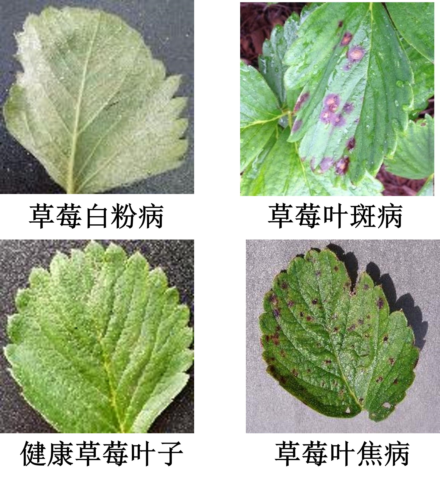
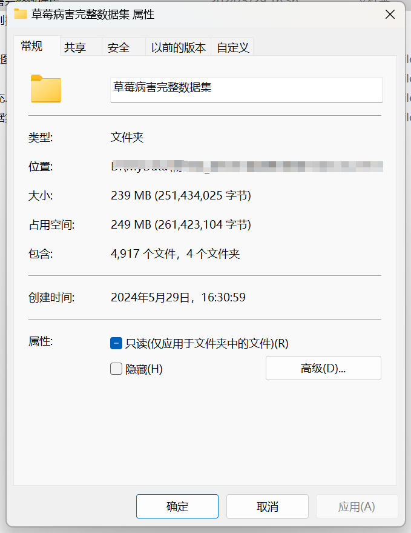
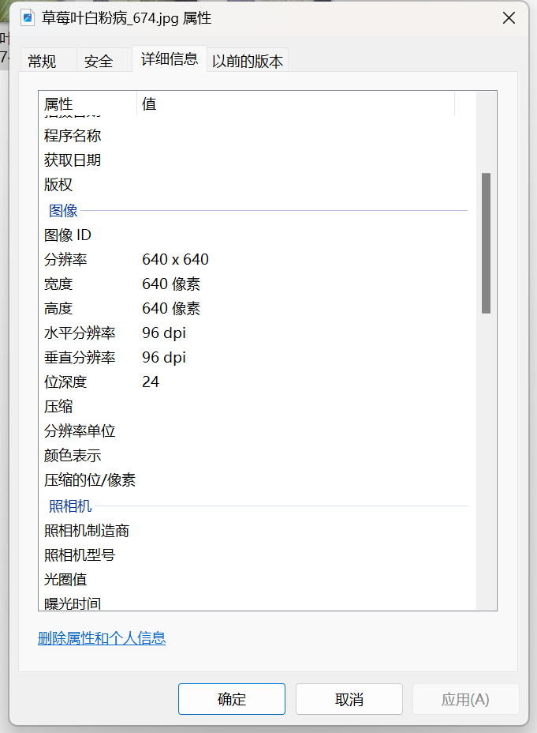

# Strawberry Leaf Disease Image Classification Dataset

Complete dataset introduction: The folder "Healthy Strawberry Leaves" contains 1335 images.
The folder "Strawberry Leaf Blight" contains 932 images.
The folder "Strawberry Leaf Burn" contains 1105 images.
The folder "Strawberry Leaf Powdery Mildew" contains 1545 images.
The total number of images in all subfolders: 4917.
Examples of the dataset images: 
To ask questions, just add your question directly. There is no need for me to approve it; you can send messages to me without my consent, and I can see them. 
When searching for me, just send all the questions at once. I will reply to you. Sometimes I am busy, so please describe your problem and intention clearly when you contact me. 
I will also reply to you when I have time, without any formality, which makes the communication more efficient. 
The phone numbers are the same above. If I forget to reply or if you are impatient, you can send a text message or call me.

## Images

Here is a pay link on Stripe ( https://buy.stripe.com/3cs8yP7sY87d0vu9AB ). Please contact me lonlonago@foxmail.com after funding $89, and I will send you a complete data files , thank you!

